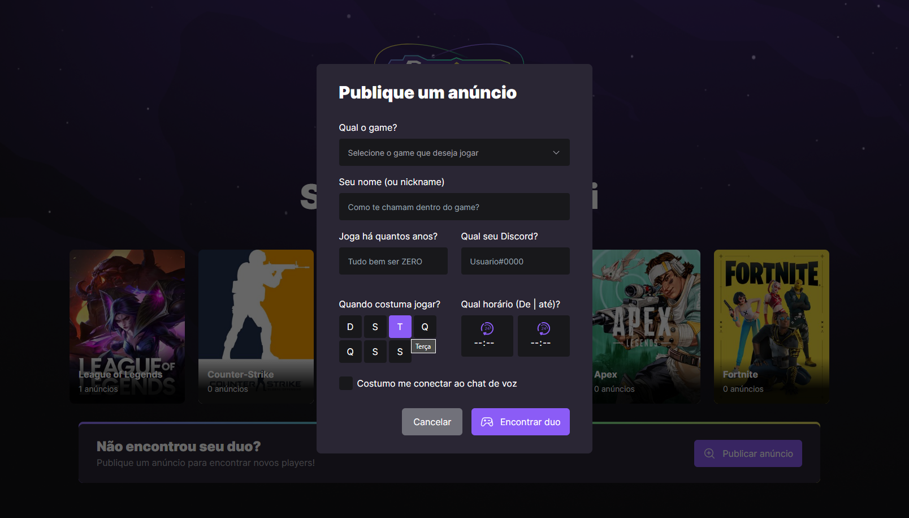

# Front e back NLW Gamer

## Sobre o projeto 💻

Projeto modelado e prototipado pela [RocketSeat](https://www.rocketseat.com.br 'Site da RocketSeat') durante a semana NLW edição gamer. [Figma do projeto](https://www.figma.com/community/file/1150897317533332617).

Além do proposto pela rocket, adicionei alguns elementos extra, seja em estilização, seja em funcionalidade, como validação de formulário (por parte do front com a lib [yup](https://github.com/jquense/yup)), icones para seleção de horário, hovers e estilizações. Faltou validar o request no back com alguma lib.

<p align="center">
 <a href="#imagens"> Imagens </a>	
</p>

## 🚀 Tecnologias

### Back end

- [Node](https://nodejs.org/en/) (typescript)
- [Prisma](https://www.prisma.io '(ORM)')

### Front end

- [React](https://pt-br.reactjs.org) com [Vite](https://vitejs.dev) (TypeScript)
- [tailwindcss](https://tailwindcss.com) - Simplesmente sensacional
- [Radix](https://tailwindcss.com) - Para acessibilidade com components sem estilização

### Banco de dados

- SQlite (relacional)

## Imagens




## .Env para o back

```
DATABASE_URL="file:../src/database/db.sqlite"
```
